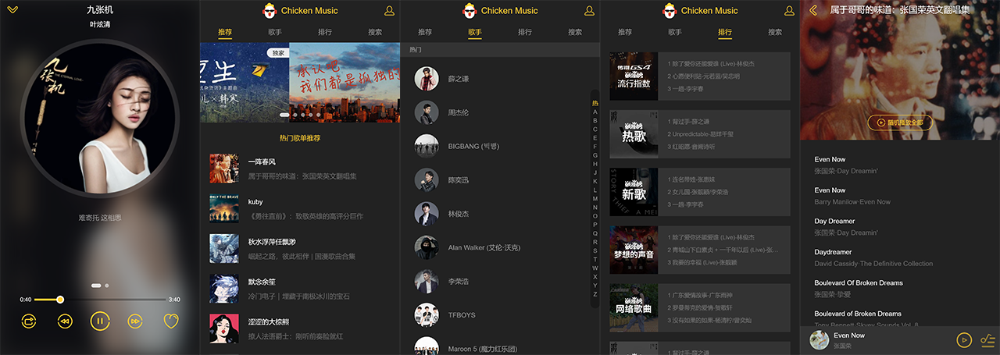

# CK-MUSIC

> Music player catch qq music api [QQMusic & QQMusic h5](https://y.qq.com) 效果页: [QQ-Music-Demo](http://qqmusic.limonplayer.cn/#/recommend)

## 简介

## tech stack

```
    "axios": "^0.17.1",
    "babel-runtime": "^6.26.0",
    "better-scroll": "^1.5.4",
    "create-keyframe-animation": "^0.1.0",
    "fastclick": "^1.0.6",
    "good-storage": "^1.0.1",
    "js-base64": "^2.4.0",
    "jsonp": "^0.2.1",
    "lyric-parser": "^1.0.1",
    "vue": "^2.5.2",
    "vue-lazyload": "^1.1.4",
    "vue-router": "^3.0.1",
    "vuex": "^3.0.1"
```

## capture

Player Show:


## 使用说明

### 配置

- 为了不占用重复的端口
- 端口设置目前为 `mobile_music` : `7990`
- 端口设置目前为 `web_music` : `7991`
- 端口设置目前为 `server_api` : `7992`

### 安装

可以参考根目录的 `.gitlab-ci.yml` 文件

```bash
# 首先是需要启动api转发服务的，不然本地调试会不成功
cd server_api
yarn
yarn dev
# 第二步可以直接去调试前端vue了，先进mobile手机端的还是webPC端的都可以
cd ../web_music
yarn
yarn dev

cd ../mobile_music
yarn
yarn dev

```

### 部署（需要更多的技术能力）

```bash
# 首先是需要部署api转发服务
cd server_api
yarn
# 这里需要安装pm2插件
pm2 start app.js
# 第二步可以直接去 build 前端vue了，先进mobile手机端的还是webPC端的都可以
# 这里默认没有修改，所以直接的利用的我服务器转发，有必要可以修改/src/api/config.js文件
cd ../web_music
yarn
yarn build
放在 nginx 或者 apache 都可以

cd ../mobile_music
yarn
yarn build
放在 nginx 或者 apache 都可以
```
