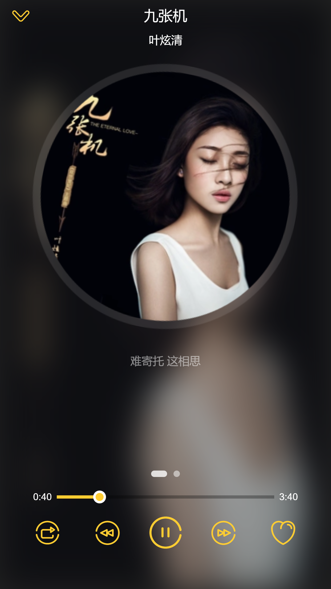

# vue-music-player

> Music player catch qq music api [QQMusic & QQMusic h5](https://y.qq.com)
效果页:
[QQ-Music-Demo](http://qqmusic.limonplayer.cn/#/recommend)

## Build Setup

``` bash
# install dependencies
npm install
# or if you installed yarn
yarn
# or if you are chinese
cnpm install


# serve with hot reload at localhost:8080
npm run dev
# or yarn
yarn dev

# build for production with minification
npm run build
# or yarn
yarn dev
```

## tech stack

- vue 2.4.2
- vuex 2.4.0
- axios 0.16.2
- jsonp 0.2.1
- more...

## capture
Player Surface:


## package history

beta v1.1 2017-09-30
- 新增分离加载模式

```
                                                  Asset       Size  Chunks                    Chunk Names
    static/css/app.27f7272448f46503382957adb7931cf8.css     105 kB       9  [emitted]         app
                      static/img/music-icon.8a34857.svg    26.9 kB          [emitted]
                    static/js/0.9bc91d5556676311fb28.js    11.4 kB       0  [emitted]
                    static/js/1.3db85114ec0f483a5ec9.js      11 kB       1  [emitted]
                    static/js/2.e4ccdc1ed21d234d8968.js    11.5 kB       2  [emitted]
                    static/js/3.8984c1c85f69228ee57a.js    12.6 kB       3  [emitted]
                    static/js/4.4de65be002794bfb2bec.js    11.4 kB       4  [emitted]
                    static/js/5.39afceea1955dc0c4581.js    5.94 kB       5  [emitted]
                    static/js/6.aa61d9666805616b552a.js    7.25 kB       6  [emitted]
                    static/js/7.395dd5e04a849f475dea.js    7.47 kB       7  [emitted]
               static/js/vendor.42fbf1d9ca35b3456b53.js     319 kB       8  [emitted]  [big]  vendor
                  static/js/app.2d5acc2250d26ad07565.js      58 kB       9  [emitted]         app
             static/js/manifest.a806642974a12440fe4c.js    1.71 kB      10  [emitted]         manifest
                    static/img/no-result@3x.2858208.png    12.7 kB          [emitted]
                static/js/0.9bc91d5556676311fb28.js.map    58.9 kB       0  [emitted]
                static/js/1.3db85114ec0f483a5ec9.js.map    60.1 kB       1  [emitted]
                static/js/2.e4ccdc1ed21d234d8968.js.map    59.2 kB       2  [emitted]
                static/js/3.8984c1c85f69228ee57a.js.map    61.4 kB       3  [emitted]
                static/js/4.4de65be002794bfb2bec.js.map    57.6 kB       4  [emitted]
                static/js/5.39afceea1955dc0c4581.js.map    30.1 kB       5  [emitted]
                static/js/6.aa61d9666805616b552a.js.map    32.2 kB       6  [emitted]
                static/js/7.395dd5e04a849f475dea.js.map    33.5 kB       7  [emitted]
           static/js/vendor.42fbf1d9ca35b3456b53.js.map    2.35 MB       8  [emitted]         vendor
              static/js/app.2d5acc2250d26ad07565.js.map     376 kB       9  [emitted]         app
static/css/app.27f7272448f46503382957adb7931cf8.css.map    47.5 kB       9  [emitted]         app
         static/js/manifest.a806642974a12440fe4c.js.map    15.2 kB      10  [emitted]         manifest
                                             index.html  671 bytes          [emitted]
```

beta v1.0 2017-09-30
```
 Asset       Size  Chunks                    Chunk Names
    static/css/app.f45d6b708d8b6a86b999a271f4c53171.css     115 kB       1  [emitted]         app
                      static/img/music-icon.8a34857.svg    26.9 kB          [emitted]
               static/js/vendor.46fba2bccd9e6c85af21.js     319 kB       0  [emitted]  [big]  vendor
                  static/js/app.dc61fbc411ddba4d79c9.js    82.5 kB       1  [emitted]         app
             static/js/manifest.e296e37959a308331ea1.js    1.51 kB       2  [emitted]         manifest
                    static/img/no-result@3x.2858208.png    12.7 kB          [emitted]
           static/js/vendor.46fba2bccd9e6c85af21.js.map    2.35 MB       0  [emitted]         vendor
              static/js/app.dc61fbc411ddba4d79c9.js.map     571 kB       1  [emitted]         app
static/css/app.f45d6b708d8b6a86b999a271f4c53171.css.map    65.5 kB       1  [emitted]         app
         static/js/manifest.e296e37959a308331ea1.js.map    14.6 kB       2  [emitted]         manifest
                                             index.html  671 bytes          [emitted]
```

For detailed explanation on how things work, checkout the [guide](http://vuejs-templates.github.io/webpack/) and [docs for vue-loader](http://vuejs.github.io/vue-loader).
